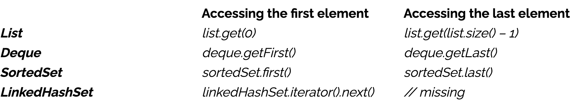
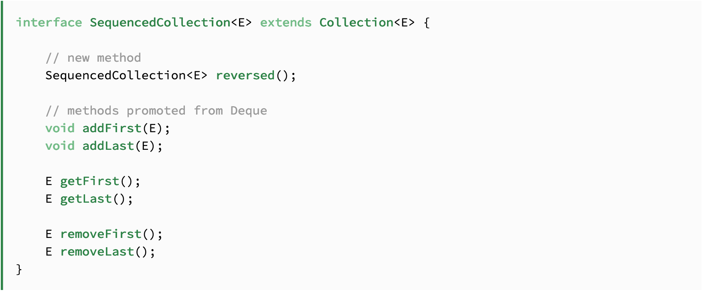

# JEP 431: Sequenced Collection

Esta JEP es la única mejora agregada como parte del proyecto **Core Libraries**.

### Objetivos de la JEP:

- Esta propuesta busca crear nuevas interfaces que permitan representar colecciones de elementos con un orden específico.
Cada una de estas colecciones tendría un primer elemento, un segundo elemento y así sucesivamente, hasta llegar al 
último.

- Además, se pretende establecer APIs uniformes que faciliten el acceso tanto al primer como al último elemento de estas 
colecciones, así como el procesamiento de sus elementos en orden inverso.

### Valor:

La idea central aquí es mejorar la productividad de los desarrolladores. Esto se lograría al ofrecer un conjunto 
uniforme de operaciones que se pueden aplicar a un tipo de colección que representa una secuencia de elementos con un 
orden específico de encuentro.

Collections antes de Java 21.

Podemos obervar la inconsistencia en el manejo de los métodos.

Collections en Java 21.

Ahora podemos usar Sequenced Collection.
